# FPL Influencer Hivemind - Pipeline Flow

```mermaid
flowchart TD
    %% ── CLI ENTRY ──
    CLI["CLI Entry<br/><code>uv run fpl-influencer-hivemind</code>"]
    CLI -->|collect| COLLECT_CMD
    CLI -->|pipeline| PIPELINE_CMD

    subgraph CLI_LAYER["CLI Layer"]
        COLLECT_CMD["<b>collect</b> command<br/>Data gathering only"]
        PIPELINE_CMD["<b>pipeline</b> command<br/>Collect + Analyze"]
    end

    COLLECT_CMD --> AGG
    PIPELINE_CMD --> AGG

    %% ── AGGREGATION PIPELINE ──
    subgraph AGGREGATION["Phase 1: Data Aggregation <i>(pipeline.py)</i>"]

        AGG["aggregate()"]
        LOAD_ENV[".env auto-load<br/>API keys, credentials"]
        AGG --> LOAD_ENV

        subgraph FPL_FETCH["FPL API Fetch"]
            GW_INFO["get_current_gameweek_info()<br/>Current/next GW, deadlines"]
            TOP_PLAYERS["get_top_players_by_form()<br/>Top 150 by form + points"]
            MY_TEAM["get_my_team_info()<br/>Squad, ITB, selling prices"]
            MOMENTUM["get_transfer_momentum()<br/>Top net transfers in/out"]
        end

        LOAD_ENV --> FPL_FETCH

        subgraph FPL_AUTH["FPL Auth Chain"]
            AUTH1["Email + Password login"]
            AUTH2["Bearer Token fallback"]
            AUTH3["Public endpoint<br/>(no selling prices)"]
            AUTH1 -->|fails| AUTH2
            AUTH2 -->|fails| AUTH3
        end

        MY_TEAM -.-> FPL_AUTH

        subgraph DISCOVERY["YouTube Video Discovery"]
            LOAD_CH["Load channels.json<br/>Channel configs"]
            DISC_LOOP["For each channel"]
            HEUR_STRAT["HeuristicDiscoveryStrategy"]

            LOAD_CH --> DISC_LOOP
            DISC_LOOP --> HEUR_STRAT

            subgraph VIDEO_PICK["Video Selection <i>(video_picker.py)</i>"]
                YT_API["YouTube Data API v3<br/>Fetch recent uploads"]
                LLM_PICK{"ANTHROPIC_API_KEY<br/>available?"}
                LLM_SELECT["LLM Pick<br/>Claude classifies<br/>team-selection video"]
                HEUR_FILTER["Heuristic Filter<br/>Keyword scoring +<br/>GW match + recency"]

                YT_API --> LLM_PICK
                LLM_PICK -->|yes| LLM_SELECT
                LLM_SELECT -->|exception| HEUR_FILTER
                LLM_PICK -->|no| HEUR_FILTER
            end

            HEUR_STRAT --> VIDEO_PICK
        end

        GW_FALLBACK{"Requested GW<br/>has videos?"}
        DISCOVERY --> GW_FALLBACK
        GW_FALLBACK -->|no| RETRY_SOURCE["Retry with source GW<br/>(fallback)"]
        GW_FALLBACK -->|yes| PROMPT_USER

        subgraph TRANSCRIPT_FETCH["Transcript Fetching"]
            PROMPT_USER{"User approves<br/>transcripts?<br/>(or auto-approve)"}
            YTIO["Primary: YouTube Transcript IO<br/>API-based, segments + timing"]
            LEGACY["Fallback: Legacy fetcher<br/>yt-dlp / EasySubAPI"]
            COERCE["Coerce segments<br/>+ join to text"]

            PROMPT_USER -->|yes| YTIO
            YTIO -->|error| LEGACY
            YTIO -->|success| COERCE
            LEGACY --> COERCE
            PROMPT_USER -->|no| SKIP_TX["Skip transcripts"]
        end

        RETRY_SOURCE --> PROMPT_USER
        FPL_FETCH --> BUILD_JSON
        COERCE --> BUILD_JSON
        SKIP_TX --> BUILD_JSON

        BUILD_JSON["Build aggregated JSON<br/>fpl_data + youtube_analysis + gameweek"]
        WRITE_JSON["Write to var/hivemind/<br/>timestamped .json file"]
        BUILD_JSON --> WRITE_JSON
    end

    %% ── COLLECT vs PIPELINE BRANCHING ──
    WRITE_JSON --> COLLECT_DONE & PIPELINE_CONT

    COLLECT_DONE["Print JSON summary<br/>(collect command done)"]
    PIPELINE_CONT{"Run analysis?<br/>(prompt or --auto-run)"}
    PIPELINE_CONT -->|no| DONE_NO_ANALYSIS["Done (no analysis)"]
    PIPELINE_CONT -->|yes| ANALYZER_CLI

    %% ── ANALYZER ──
    ANALYZER_CLI["Analyzer CLI<br/><code>fpl_intelligence_analyzer.py</code><br/>(subprocess)"]
    ANALYZER_CLI --> RUN_ANALYSIS

    subgraph ANALYZER["Phase 2: Intelligence Analysis <i>(orchestrator.py)</i>"]

        RUN_ANALYSIS["run_analysis()<br/>Load aggregated JSON"]

        %% ── CHANNEL ANALYSIS ──
        subgraph CH_ANALYSIS["Channel-by-Channel Analysis"]
            CONDENSE["condense_player_list()<br/>Top 150 players essentials"]
            BUILD_LOOKUP["build_player_lookup()<br/>Normalized name index"]
            CH_LOOP["For each video with transcript"]
            ANALYZE_CH["analyze_channel()<br/><b>LLM: Opus</b><br/>Extract: team picks, transfers,<br/>captain, watchlist, confidence"]
            CANON["canonicalize_channel_analysis()<br/>Normalize player names"]
            QUALITY_FILTER{"confidence >= 0.70<br/>AND transcript >= 3000 chars?"}
            KEEP["Keep analysis"]
            DROP["Drop analysis"]

            CONDENSE --> BUILD_LOOKUP --> CH_LOOP
            CH_LOOP --> ANALYZE_CH --> CANON --> QUALITY_FILTER
            QUALITY_FILTER -->|yes| KEEP
            QUALITY_FILTER -->|no| DROP
        end

        RUN_ANALYSIS --> CH_ANALYSIS

        %% ── STAGED ANALYSIS ──
        subgraph STAGES["Multi-Stage Analysis <i>(_run_staged_analysis)</i>"]

            %% Stage 1
            subgraph S1["Stage 1: Gap Analysis"]
                AGG_CONSENSUS["aggregate_influencer_consensus()<br/>Captain counts, transfer counts,<br/>watchlist, rotation warnings"]
                GAP_LLM["stage_gap_analysis()<br/><b>LLM: Opus</b><br/>Squad vs influencer consensus"]
                SEVERITY["Severity scoring<br/>Base: influencer count<br/>+3 captain, +2 injury,<br/>+1 form/momentum, -1 rotation"]
                AGG_CONSENSUS --> GAP_LLM --> SEVERITY
            end

            %% Stage 2
            subgraph S2["Stage 2: Transfer Plan"]
                SEV_GUIDE["Build severity guidance<br/>Critical/high gap priorities"]
                TRANSFER_LLM["stage_transfer_plan()<br/><b>LLM: Opus</b><br/>Generate transfers"]
                APPLY_PRICE["apply_transfer_pricing()<br/>Validate vs FPL data"]
                POST_SQUAD["compute_post_transfer_squad()<br/>Apply transfers to squad"]

                subgraph S2_VALIDATE["Transfer Validation"]
                    MECH_T["Mechanical checks<br/>Position match, budget,<br/>club limits (max 3)"]
                    COH_GAP["Gap-to-transfer cohesion<br/>Captain gap addressed?<br/><b>LLM: Haiku</b> justification"]
                    COH_CONS["Consensus coverage<br/>3+ influencer recs covered?<br/><b>LLM: Haiku</b> justification"]
                end

                S2_RETRY{"Errors?"}
                S2_OK["Stage 2 passed"]

                SEV_GUIDE --> TRANSFER_LLM --> APPLY_PRICE --> POST_SQUAD
                POST_SQUAD --> S2_VALIDATE
                S2_VALIDATE --> S2_RETRY
                S2_RETRY -->|"yes (retry, max 2)"| TRANSFER_LLM
                S2_RETRY -->|no| S2_OK
            end

            %% Stage 3
            subgraph S3["Stage 3: Lineup Selection"]
                ENRICH["enrich_squad_with_stats()<br/>Add form, xPts, ICT, availability"]
                AGG_XI["aggregate_influencer_xi()<br/>XI counts, formation votes"]
                LINEUP_LLM["stage_lineup_selection()<br/><b>LLM: Opus</b><br/>Pick XI, bench, captain"]

                subgraph S3_VALIDATE["Lineup Validation"]
                    MECH_L["Mechanical checks<br/>11 starters, 4 bench,<br/>formation rules, captain in XI"]
                    RISK_L["Risk contingency<br/>Risky captain needs safe vice<br/>Risky XI needs bench backup"]
                end

                S3_RETRY{"Errors?"}
                S3_OK["Stage 3 passed"]

                ENRICH --> AGG_XI --> LINEUP_LLM --> S3_VALIDATE
                S3_VALIDATE --> S3_RETRY
                S3_RETRY -->|"yes (retry, max 2)"| LINEUP_LLM
                S3_RETRY -->|no| S3_OK
            end

            %% Final validation
            FINAL_V["validate_all()<br/>Comprehensive check<br/>mechanical + cohesion + risk"]

            S1 --> S2
            S2 --> S3
            S3 --> FINAL_V
        end

        CH_ANALYSIS --> STAGES

        %% ── DECISION OPTIONS ──
        subgraph OPTIONS["Decision Options Building"]
            PARSE_COMM{"User commentary<br/>has transfer requests?<br/><b>LLM: Haiku</b>"}

            subgraph OPT_REQUESTED["User-Requested Options"]
                REQ_BUILD["Build exact transfer counts<br/>e.g. '1 transfer', '2 with hit'"]
            end

            subgraph OPT_STRATEGY["Severity-Driven Options"]
                SEV_CHECK{"total_severity?"}
                SEV_LOW["< 4: Roll only<br/>(1 option)"]
                SEV_MID["4-12: Conservative + Fix<br/>(2 options)"]
                SEV_HIGH[">= 12: Conservative +<br/>Balanced + Aggressive<br/>(2-3 options)"]
                SEV_CHECK --> SEV_LOW & SEV_MID & SEV_HIGH
            end

            subgraph OPT_HEURISTIC["Legacy Heuristic Options"]
                HEUR_A["Option A: Primary<br/>(from staged analysis)"]
                HEUR_B["Option B: Roll or<br/>activate transfer"]
                HEUR_C["Option C: Aggressive<br/>or maximize FTs"]
            end

            PARSE_COMM -->|"explicit requests found"| OPT_REQUESTED
            PARSE_COMM -->|"no requests,<br/>ScoredGapAnalysis"| OPT_STRATEGY
            PARSE_COMM -->|"no requests,<br/>no scored gaps"| OPT_HEURISTIC

            SANITIZE["Sanitize reasoning<br/>Align text with actual transfers"]
            OPT_REQUESTED --> SANITIZE
            OPT_STRATEGY --> SANITIZE
            OPT_HEURISTIC --> SANITIZE
        end

        STAGES --> OPTIONS

        %% ── QUALITY REVIEW ──
        subgraph QR["Quality Review & Correction"]
            QR_RUN["holistic_quality_review()<br/><b>LLM: Opus</b><br/>Internal consistency check"]
            QR_CHECK{"Fixable issues<br/>found?"}
            CORRECT["_correct_decision_option()<br/>Re-run affected stages<br/>with fix instructions"]
            QR_RERUN["Re-run quality review<br/>on corrected option"]
            QR_FINAL["Final QualityReview<br/>confidence_score, strength"]

            QR_RUN --> QR_CHECK
            QR_CHECK -->|yes| CORRECT --> QR_RERUN --> QR_FINAL
            QR_CHECK -->|no| QR_FINAL
        end

        OPTIONS --> QR

        %% ── REPORT ──
        subgraph REPORT["Report Assembly <i>(report.py)</i>"]
            R_CONSENSUS["Consensus Snapshot<br/>Captaincy matrix, transfer targets"]
            R_CHANNELS["Channel-by-Channel Notes<br/>Per-influencer breakdown"]
            R_CHIPS["Chip Strategy<br/>Wildcard/FH/BB consensus"]
            R_GAP["Gap Analysis Section<br/>Severity bars, risk flags"]
            R_OWNERSHIP["High-Ownership Missing<br/>Popular players not in squad"]
            R_ACTION["Action Plan<br/>Decision options with<br/>transfers, lineups, rationale"]
            R_QUALITY["Quality Assessment<br/>Confidence, alignment, risks"]

            R_CONSENSUS --> R_CHANNELS --> R_CHIPS --> R_GAP --> R_OWNERSHIP --> R_ACTION --> R_QUALITY
        end

        QR --> REPORT
    end

    REPORT --> OUTPUT

    OUTPUT["Markdown Report<br/>Written to var/hivemind/<br/>or stdout"]

    %% ── STYLING ──
    classDef llmOpus fill:#4a90d9,color:#fff,stroke:#2a5a9a
    classDef llmHaiku fill:#7cb342,color:#fff,stroke:#4a7a22
    classDef decision fill:#f9a825,color:#000,stroke:#c77f00
    classDef error fill:#ef5350,color:#fff,stroke:#c62828
    classDef phase fill:#ab47bc,color:#fff,stroke:#7b1fa2
    classDef data fill:#78909c,color:#fff,stroke:#455a64

    class GAP_LLM,TRANSFER_LLM,LINEUP_LLM,ANALYZE_CH,QR_RUN llmOpus
    class COH_GAP,COH_CONS,PARSE_COMM llmHaiku
    class LLM_PICK,GW_FALLBACK,PROMPT_USER,QUALITY_FILTER,S2_RETRY,S3_RETRY,QR_CHECK,PIPELINE_CONT,SEV_CHECK decision
    class AGG,RUN_ANALYSIS phase
    class BUILD_JSON,WRITE_JSON,OUTPUT data
```

## LLM Model Usage

| Stage | Model | Purpose |
|-------|-------|---------|
| Video discovery | Claude (configurable) | Classify team-selection videos |
| Channel analysis | **Opus 4.6** | Extract picks, transfers, captain from transcript |
| Stage 1: Gap analysis | **Opus 4.6** | Identify squad vs influencer consensus gaps |
| Stage 2: Transfer plan | **Opus 4.6** | Generate transfers addressing gaps |
| Stage 2 validation | **Haiku** | Verify justifications for excluded recs |
| Stage 3: Lineup | **Opus 4.6** | Select XI, bench, captain/vice |
| Commentary parsing | **Haiku** | Extract user transfer count requests |
| Quality review | **Opus 4.6** | Holistic internal consistency check |

## Retry & Correction Loops

1. **Video Discovery Fallback** - If requested GW has no videos, retry with source GW
2. **Transcript Fallback** - YouTube Transcript IO fails, falls back to yt-dlp/EasySubAPI
3. **FPL Auth Chain** - Email/password -> Bearer token -> Public endpoint
4. **Stage 2 Retry** - Up to 2 attempts if transfer validation fails (errors fed back to LLM)
5. **Stage 3 Retry** - Up to 2 attempts if lineup validation fails
6. **Corrective Loop** - Quality review finds fixable issues -> re-run affected stages -> re-validate
