# FPL Influencer Hivemind - Pipeline Flow

```mermaid
flowchart TD
    %% ── CLI ENTRY ──
    CLI["CLI Entry<br/><code>uv run fpl-influencer-hivemind</code>"]
    CLI -->|collect| COLLECT_CMD
    CLI -->|pipeline| PIPELINE_CMD

    subgraph CLI_LAYER["CLI Layer"]
        COLLECT_CMD["<b>collect</b> command<br/>Data gathering only"]
        PIPELINE_CMD["<b>pipeline</b> command<br/>Collect + Analyze"]
    end

    COLLECT_CMD --> AGG
    PIPELINE_CMD --> AGG

    %% ── AGGREGATION PIPELINE ──
    subgraph AGGREGATION["Phase 1: Data Aggregation <i>(pipeline.py)</i>"]

        AGG["aggregate()"]
        LOAD_ENV[".env auto-load<br/>API keys, credentials"]
        AGG --> LOAD_ENV

        subgraph FPL_FETCH["FPL API Fetch"]
            GW_INFO["get_current_gameweek_info()<br/>Current/next GW, deadlines"]
            TOP_PLAYERS["get_top_players_by_form()<br/>Top 150 by form + points"]
            MY_TEAM["get_my_team_info()<br/>Squad, ITB, selling prices"]
            MOMENTUM["get_transfer_momentum()<br/>Top net transfers in/out"]
        end

        LOAD_ENV --> FPL_FETCH

        subgraph FPL_AUTH["FPL Auth Chain"]
            AUTH1["Email + Password login"]
            AUTH2["Bearer Token fallback"]
            AUTH3["Public endpoint<br/>(no selling prices)"]
            AUTH1 -->|fails| AUTH2
            AUTH2 -->|fails| AUTH3
        end

        MY_TEAM -.-> FPL_AUTH

        subgraph DISCOVERY["YouTube Video Discovery"]
            LOAD_CH["Load channels.json<br/>Channel configs"]
            DISC_LOOP["For each channel"]
            HEUR_STRAT["HeuristicDiscoveryStrategy"]

            LOAD_CH --> DISC_LOOP
            DISC_LOOP --> HEUR_STRAT

            subgraph VIDEO_PICK["Video Selection <i>(video_picker.py)</i>"]
                YT_API["YouTube Data API v3<br/>Fetch recent uploads"]
                LLM_PICK{"ANTHROPIC_API_KEY<br/>available?"}
                LLM_SELECT["LLM Pick<br/>Claude classifies<br/>team-selection video"]
                HEUR_FILTER["Heuristic Filter<br/>Keyword scoring +<br/>GW match + recency"]

                YT_API --> LLM_PICK
                LLM_PICK -->|yes| LLM_SELECT
                LLM_SELECT -->|exception| HEUR_FILTER
                LLM_PICK -->|no| HEUR_FILTER
            end

            HEUR_STRAT --> VIDEO_PICK
        end

        GW_FALLBACK{"Requested GW<br/>has videos?"}
        DISCOVERY --> GW_FALLBACK
        GW_FALLBACK -->|no| RETRY_SOURCE["Retry with source GW<br/>(fallback)"]
        GW_FALLBACK -->|yes| PROMPT_USER

        subgraph TRANSCRIPT_FETCH["Transcript Fetching"]
            PROMPT_USER{"User approves<br/>transcripts?<br/>(or auto-approve)"}
            YTIO["Primary: YouTube Transcript IO<br/>API-based, segments + timing"]
            LEGACY["Fallback: Legacy fetcher<br/>yt-dlp / EasySubAPI"]
            COERCE["Coerce segments<br/>+ join to text"]

            PROMPT_USER -->|yes| YTIO
            YTIO -->|error| LEGACY
            YTIO -->|success| COERCE
            LEGACY --> COERCE
            PROMPT_USER -->|no| SKIP_TX["Skip transcripts"]
        end

        RETRY_SOURCE --> PROMPT_USER
        FPL_FETCH --> BUILD_JSON
        COERCE --> BUILD_JSON
        SKIP_TX --> BUILD_JSON

        BUILD_JSON["Build aggregated JSON<br/>fpl_data + youtube_analysis + gameweek"]
        WRITE_JSON["Write to var/hivemind/<br/>timestamped .json file"]
        BUILD_JSON --> WRITE_JSON
    end

    %% ── COLLECT vs PIPELINE BRANCHING ──
    WRITE_JSON --> COLLECT_DONE & PIPELINE_CONT

    COLLECT_DONE["Print JSON summary<br/>(collect command done)"]
    PIPELINE_CONT{"Run analysis?<br/>(prompt or --auto-run)"}
    PIPELINE_CONT -->|no| DONE_NO_ANALYSIS["Done (no analysis)"]
    PIPELINE_CONT -->|yes| ANALYZER_CLI

    %% ── ANALYZER ──
    ANALYZER_CLI["Analyzer CLI<br/><code>fpl_intelligence_analyzer.py</code><br/>(subprocess)"]
    ANALYZER_CLI --> RUN_ANALYSIS

    subgraph ANALYZER["Phase 2: Deterministic Analyzer <i>(simple_orchestrator.py)</i>"]

        RUN_ANALYSIS["run_analysis()<br/>Load aggregated JSON"]

        subgraph EXTRACT["LLM Extraction (Structured + Evidence)"]
            EXTRACT_LLM["Extract channel decisions<br/>+ context with quotes<br/>(extract_channel.txt)"]
            VALIDATE["Validate lineup shape<br/>+ uniqueness"]
            RESOLVE["Resolve player names<br/>to element_id"]
            EXTRACT_LLM --> VALIDATE --> RESOLVE
        end

        subgraph CONSENSUS["Deterministic Consensus"]
            CONS_COUNTS["Count captains, transfers, watchlist, chips<br/>by element_id"]
        end

        subgraph GAP["Deterministic Gap Analysis"]
            GAP_RULES["Missing, sell, captain gap<br/>+ severity scoring"]
        end

        subgraph OPTIONS["Deterministic Transfer Options"]
            SOLVER["Rule-based solver<br/>budget + club + FTs (no hits)<br/>roll + consensus + conservative"]
        end

        subgraph LINEUP["Deterministic Lineup Selection"]
            XI_PICK["Formation-valid XI<br/>score = ep_next → form → total_points"]
        end

        subgraph QA["Deterministic Quality Audit"]
            QA_CHECKS["validate_transfers + validate_lineup<br/>no LLM checks"]
        end

        subgraph REPORT["Report Assembly"]
            CONS_SECTION["Consensus snapshot (computed)"]
            GAP_SECTION["Gap analysis (computed)"]
            OPTION_SECTION["Transfer options (computed)"]
            LINEUP_SECTION["Lineup + captain/vice (computed)"]
            CONTEXT_SECTION["Influencer context<br/>(evidence only)"]
            AUDIT_SECTION["Deterministic quality audit"]
        end

        RUN_ANALYSIS --> EXTRACT
        EXTRACT --> CONSENSUS --> GAP --> OPTIONS --> LINEUP --> QA --> REPORT
    end

    REPORT --> OUTPUT["Markdown Report<br/>Written to var/hivemind/ or stdout"]
    OUTPUT -.-> NARRATIVE["Optional narrative summary<br/>(narrative_report.txt)"]
```

## Notes
- LLM usage is limited to transcript extraction and optional narrative summarization.
- All decisions (consensus, gaps, transfers, lineup, QA) are deterministic and grounded in FPL API data.
