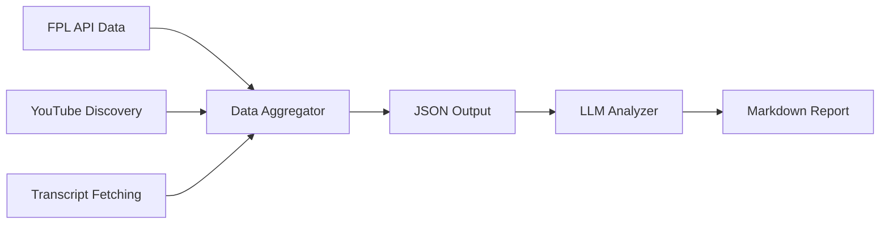

# FPL Influencer Hivemind

A comprehensive Fantasy Premier League (FPL) decision support system that aggregates data from popular FPL influencers and generates AI-powered transfer and captain recommendations using Claude-4 models.

## 🚀 Quick Start

### Prerequisites
```bash
# Install dependencies
uv sync

# Set up Anthropic API key for LLM analysis
export ANTHROPIC_API_KEY="your-anthropic-api-key"
```

### Run Complete FPL Analysis (2-Step Process)

**Step 1: Data Collection** - Collect FPL data + analyze 5 YouTube channels in parallel
```bash
./fpl_data_aggregator.sh --team-id 1234 --output-file gameweek_data.json --verbose
```

**Step 2: LLM Analysis** - Generate AI-powered recommendations using Claude-4
```bash
./fpl_intelligence_analyzer.py --input gameweek_data.json --output-file analysis.md --verbose
```

**Result**: 160+ line markdown report with personalized transfer recommendations, captain analysis, and consensus insights from 5 FPL influencers. See [gameweek_2_analysis_EXAMPLE.md](./gameweek_2_analysis_EXAMPLE.md) for an example analysis.

## ✨ Key Features

- **🔄 Complete Pipeline**: End-to-end data collection → LLM analysis → actionable recommendations
- **⚡ Parallel Processing**: Simultaneous analysis of 5 FPL YouTube channels (FPL Raptor, FPL Mate, Let's Talk FPL, FPL Focal, FPL Harry)
- **🤖 Claude-4 Integration**: Two-phase LLM analysis using latest Sonnet-4 and Opus-4 models
- **🏥 Injury Awareness**: Player status integration (available/doubtful/injured/suspended/unavailable)
- **📊 Rich Output**: Detailed markdown reports with executive summaries, consensus analysis, and specific recommendations
- **🛡️ Fault Tolerant**: Robust error handling with graceful degradation if individual channels fail

## 🏗️ Architecture: Script-First Development

This project follows a **script-first development approach** where individual components are developed as production-ready, standalone scripts before integration.

### Current Structure

```
├── fpl_data_aggregator.sh           # 🎯 Main orchestrator - data collection pipeline
├── fpl_intelligence_analyzer.py     # 🧠 LLM analysis engine
├── fpl/                            # FPL API data analysis scripts
├── youtube-titles/                 # YouTube video discovery & ranking
├── youtube-transcript/             # Transcript fetching & processing
├── src/fpl_influencer_hivemind/    # Main package (for future integration)
└── tests/                          # Test suite
```

### Pipeline Flow



## 🔧 Individual Component Testing

Test components independently during development:

```bash
# Test FPL API integration
uv run fpl/get_my_team.py --entry-id 1178124

# Test video discovery for single channel
./youtube-titles/fpl_video_picker.py --single-channel "FPL Raptor" --gameweek 5 --verbose

# Test transcript fetching
./youtube-transcript/fpl_transcript.py --id VIDEO_ID --format txt

# Test parallel channel processing
./youtube-titles/run_parallel_channels.sh --gameweek 5 --verbose
```

## 📋 FPL Data Analysis Components

Production-ready CLI scripts for Fantasy Premier League data:

- **`get_team_players.py`** - Premier League club roster analysis with fuzzy team matching
- **`get_top_ownership.py`** - Top 150+ FPL players ranked by ownership percentage with injury status
- **`get_current_gameweek.py`** - Smart gameweek detection with deadline timezone handling  
- **`get_my_team.py`** - Personal FPL team analysis using entry ID

Each script supports multiple output formats (table, CSV, JSON) and uses PEP 723 inline dependencies for standalone execution.

## 🎥 YouTube Analysis Pipeline

### Video Discovery (`./youtube-titles/`)
- **Intelligent content filtering**: Uses yt-dlp + Claude integration for "team selection" content ranking
- **Parallel processing**: Shell orchestrator launches multiple channels simultaneously
- **Channel configuration**: Structured metadata for 5 popular FPL influencers
- **Fault tolerance**: Individual channel failures don't break the pipeline

### Transcript Processing (`./youtube-transcript/`)
- **Multi-format support**: txt, json, csv, srt, vtt output options
- **Robust fetching**: Handles various YouTube URL formats with retry logic and language fallback
- **LLM optimized**: Clean text output with newline processing for AI analysis

## 🧠 LLM Analysis Engine

The intelligence analyzer implements a **two-phase LLM analysis**:

1. **Phase 1 - Individual Analysis** (Sonnet-4): Analyzes each channel's transcript for team selections, transfers, captain choices, and reasoning
2. **Phase 2 - Comparative Analysis** (Opus-4): Generates comprehensive report comparing influencer consensus with personalized recommendations

### Key Analysis Features
- **Injury integration**: Considers player status (a/d/i/s/u codes) in all recommendations
- **Consensus detection**: Identifies where influencers agree/disagree
- **Personalized advice**: Specific recommendations for your current team
- **Risk assessment**: Evaluates different strategies with confidence scoring

## 🛠️ Development

### Quality Standards
- **Type hints**: Strict mypy compliance (no `Any` types)
- **Test coverage**: 80% minimum requirement
- **Code style**: Ruff for linting and formatting
- **Python versions**: 3.11+ support

### Development Commands
```bash
# Install with dev dependencies
uv sync

# Quality checks
uv run pytest                    # Tests with coverage
uv run ruff check . --fix        # Lint and fix
uv run mypy src                  # Type checking
nox                             # All checks across Python versions
```

See [CLAUDE.md](./CLAUDE.md) for complete development workflow and architecture details.

## 🔮 Future Integration

As components mature, successful scripts migrate into the unified package:

```
src/fpl_influencer_hivemind/
├── fpl_tools/           # From ./fpl/ scripts
├── youtube_tools/       # From ./youtube-*/ scripts  
├── analysis/            # LLM analysis logic
└── cli/                 # Unified command interface
```

This script-first approach ensures stable, tested components before coupling.

## 🎯 Example Output

The system generates comprehensive analysis like:

```markdown
# FPL Intelligence Analysis - Gameweek 5

**Generated:** 2025-01-19 14:30:22
**Channels Analyzed:** 5
**Data Source:** gameweek_5_data.json

## Executive Summary
- **Strong consensus on Salah captaincy** across all 5 influencers
- **João Pedro emerging as essential** - 54.5% ownership, penalty taker
- **Palmer injury concerns** - status 'd' but favorable fixtures...

## Transfer Recommendations
1. **Immediate Action: ROLL TRANSFER** ✅
2. **Priority Watch List for GW6:**
   - Wan-Bissaka OUT → Milenković IN (injury status: 'a')...
```

## TODO
* Each component is a disaparate script, need to bring into a main 'project'
* Prompt optimization for better reports
    * Ensure each influencer's views are summarized out in their own section
* Data generation script is a shell script not Python
* Use Temporal for reliable orchestration, on a schedule
* Markdown -> PDF or HTML report for readability?

---

**My Team ID**: 1178124 | **Channels**: 5 FPL influencers | **Models**: Claude Sonnet-4 & Opus-4
